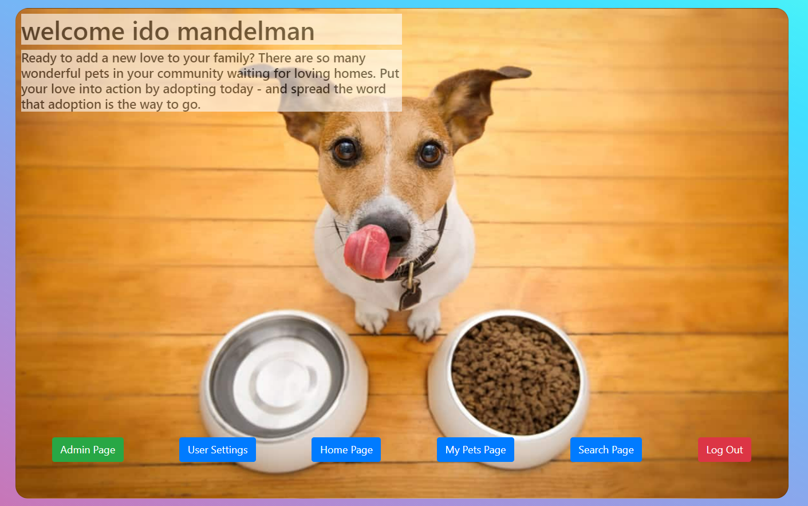

# Pet Adoption Project (Frontend Repo)

## Description
A full-stack project for adopting pets. Including the ability to add and edit users and pets into a Mongo DB database using a Node JS and express backend.

A full-stack project for adopting pets. Including the ability to add and edit users and pets into a Mongo DB database using a Node JS and express backend.
This project is no longer being managed because it is in progress of being updated to incorporate into Pet-Adoption 2.0 that have Next.JS as a framework, Styled-Component library for the design and TypeScript, and will be uploaded soon. 
Because of that There is no way do demonstrate the live usage of this project because of the lack of the .ENV files that are a key to be used with the database.

## License
[MIT](https://choosealicense.com/licenses/mit/)

